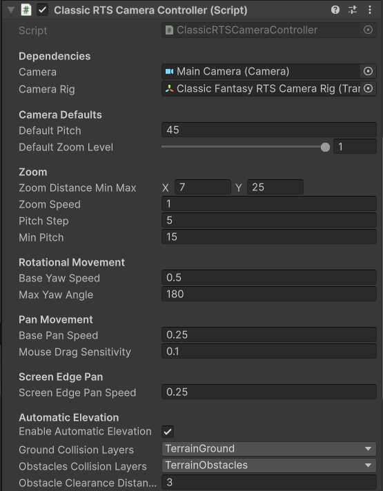
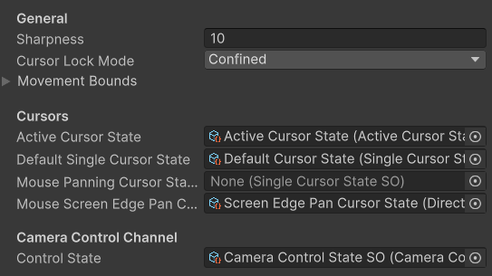

# Classic RTS Camera Controller

A fixed-angle overhead camera inspired by classic Blizzard-era RTS games such as Warcraft 3 and StarCraft 2. The camera maintains a consistent pitch that gradually tilts downward as you zoom in, giving a more grounded perspective when close to the ground. Camera yaw can be temporarily rotated but snaps back to the default orientation when the rotation keys are released.

Two prefab variants are included:

| Prefab | Inspiration |
|---|---|
| `ClassicFantasyRTSCameraController` | Tuned to match the feel of Warcraft 3 |
| `ClassicSciFiRTSCameraController` | Tuned to match the feel of StarCraft 2 |

---

## Controls

### Keyboard

| Input | Action |
|---|---|
| `Arrow Keys` | Pan the camera |
| `Delete` / `Insert` | Rotate camera yaw (snaps back to default when released) |

### Mouse

| Input | Action |
|---|---|
| `Scroll Click + Drag` | Pan the camera |
| `Scroll Wheel` | Zoom in / out (tilts pitch downward at maximum zoom) |

You can also pan the camera by moving the mouse cursor to the **edges of the screen**.

!!! tip "Remapping controls"
    All keybindings are defined in the `InputActions` asset for this controller. See [Input Remapping](../advanced/input-remapping.md).

---

## Configuration

Key properties exposed on the controller component:

| Property | Description |
|---|---|
| **Default Pitch** | The pitch angle the camera is tilted at when zoomed out |
| **Min / Max Zoom** | The closest and furthest zoom distances (0 is the ground plane) |
| **Pitch at Max Zoom** | The camera pitch applied when fully zoomed in (camera tilts upward when you reach max zoom) |
| **Pan Speed** | Base speed for keyboard and edge-scroll panning |
| **Max Yaw Angle** | Maximum allowed rotation - in WC3 camera this is 180 degrees and in SC2 it's 45 |

---

## Rig Structure

The Classic RTS camera uses a **rig** - the camera is a child object of a rig GameObject. The rig translates through the scene while the camera child handles zoom and pitch offset.

When building your own setup without the prefab, ensure the camera is parented to the rig and that the controller script is on the rig.

---

## Related

- [Simulation Camera](./simulation-camera.md)
- [Tactical War Camera](./tactical-war-camera.md)
- [Camera Bounds](../advanced/camera-bounds.md)
- [Automatic Elevation Adjustment](../advanced/auto-elevation.md)
