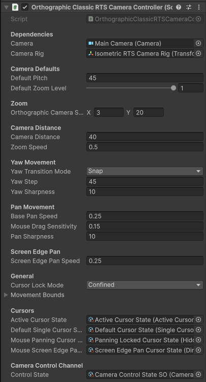

# Orthographic Classic RTS Camera Controller

An orthographic variant of the [Classic RTS Camera](./classic-rts-camera.md) that uses Unity's orthographic projection. Instead of zooming by moving the camera closer to the ground, zooming adjusts the camera's orthographic size, keeping geometry scale consistent across the entire view. The camera maintains a fixed pitch angle and supports configurable yaw rotation that snaps to fixed
angle steps.

---

## Controls

### Keyboard

| Input | Action |
|---|---|
| `Arrow Keys` / `WASD` | Pan the camera |
| `Q` / `E` | Rotate camera yaw |

### Mouse

| Input | Action |
|---|---|
| `Scroll Click + Drag` | Pan the camera |
| `Scroll Wheel` | Zoom in / out (adjusts orthographic size) |

You can also pan the camera by moving the mouse cursor to the **edges of the screen**.

!!! tip "Remapping controls"
    All keybindings are defined in the `InputActions` asset for this controller. See [Input Remapping](../advanced/input-remapping.md).

---

## Configuration

Key properties exposed on the controller component:

| Property | Description |
|---|---|
| **Default Pitch** | The fixed pitch angle (degrees below horizontal) the camera is tilted at |
| **Orthographic Camera Size Min / Max** | The closest and furthest zoom levels expressed as orthographic camera size |
| **Default Zoom Level** | Normalized starting zoom level (0–1) within the orthographic size range |
| **Camera Distance** | Distance of the camera from the rig focus point along the view axis - since this is an orthographic camera, every object is the same distance from the camera, and the actual world distance of the camera from objects only matters for clipping purposes and shadow rendering. |
| **Zoom Speed** | How quickly the orthographic size changes per scroll input |
| **Yaw Transition Mode** | `Snap` - yaw jumps in discrete steps; `Smooth` - yaw interpolates toward the target. Note that yaw still happens in angle steps, this setting merely determines whether it snaps immediately or smoothly interpolates |
| **Yaw Step** | Degrees rotated per yaw input step |
| **Yaw Sharpness** | Interpolation speed used when Yaw Transition Mode is set to Smooth |
| **Pan Speed** | Base speed for keyboard and edge-scroll panning |
| **Pan Sharpness** | How quickly the camera interpolates toward its target pan position |
| **Screen Edge Pan Speed** | Pan speed when the cursor reaches the screen edges |
| **Movement Bounds** | The camera is constrained within these world-space bounds |

---

## Rig Structure

The Orthographic Classic RTS camera uses a **rig** — the camera is a child object of a rig GameObject. The rig translates through the scene while the camera child maintains the pitch and distance offset.

When building your own setup without the prefab, ensure the camera is parented to the rig and that the controller script is on the rig.

---

## Related

- [Classic RTS Camera](./classic-rts-camera.md)
- [Simulation Camera](./simulation-camera.md)
- [Camera Bounds](../advanced/camera-bounds.md)
- [Automatic Elevation Adjustment](../advanced/auto-elevation.md)
