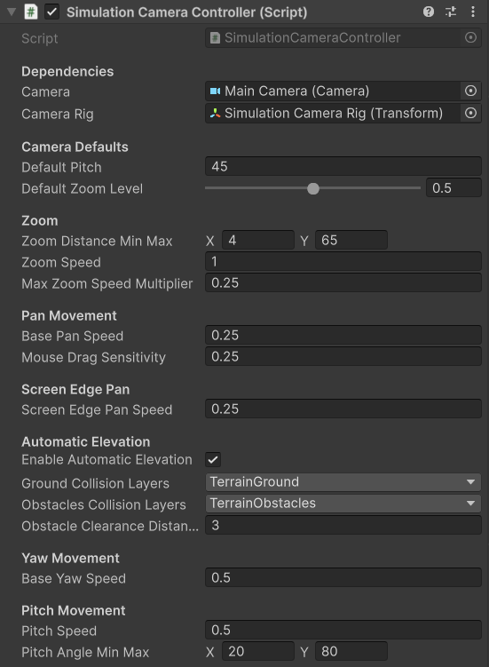
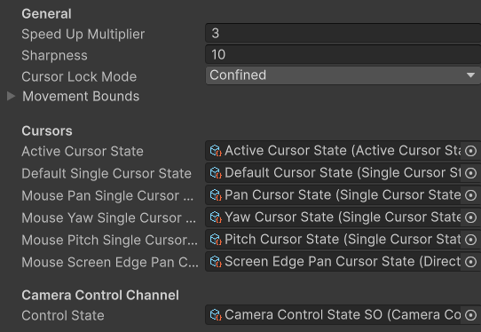

# Simulation Camera Controller

The Simulation Camera supports full yaw, pitch, and pan control through both keyboard and mouse, as well as screen-edge panning. It is well suited for 4X strategy games, city builders, or any game that requires the player to freely orient the camera and view the action from all sides.

---

## Controls

### Keyboard

| Input | Action |
|---|---|
| `WASD` or `Arrow Keys` | Pan the camera |
| `Q` / `E` | Rotate camera yaw |
| `Space` | Reset pitch and yaw to defaults |
| `Escape` *(Editor only)* | Release Game focus — stops camera input and frees the cursor |

### Mouse

| Input | Action |
|---|---|
| `Left Click + Drag` | Pan the camera |
| `Right Click + Drag` | Rotate camera yaw |
| `Scroll Click + Drag` | Rotate camera pitch |
| `Scroll Wheel` | Zoom in / out |

You can also pan the camera by moving the mouse cursor to the **edges of the screen**.

!!! tip "Remapping controls"
    All keybindings are defined in the `InputActions` asset for this controller. See [Input Remapping](../advanced/input-remapping.md).

---

## Zoom-Based Pan Speed Scaling

The Simulation Camera automatically adjusts its pan speed based on the current zoom level. This keeps movement feeling consistent regardless of altitude:

- At **maximum zoom** (zoomed out) — the camera pans **slower**
- At **minimum zoom** (zoomed in) — the camera pans **faster**

This behaviour is controlled by the **`m_maxZoomSpeedMultiplier`** property on the controller component.

---

## Configuration

Key properties exposed on the controller component:

| Property | Description |
|---|---|
| **Min / Max Zoom** | The closest and furthest zoom distances |
| **Default Pitch** | The pitch the camera resets to when `Space` is pressed |
| **Pan Speed** | Adjust speeds for keyboard, drag and edge scroll panning |
| **Yaw Speed** | Rotation speed for keyboard and right-click-drag yaw |
| **Pitch Speed** | Rotation speed for scroll-click-drag pitch |
| **Max Zoom Speed Multiplier** | Multiplier applied to pan speed at maximum zoom level for Zoom-Based Pan Speed Scaling |
| **Enable Automatic Elevation** | The camera tries to lift above terrain marked in the specified layers |

---

## Rig Structure

The Simulation Camera uses a **rig** - the camera is a child object of a rig GameObject. The rig handles translation and yaw, while the camera child handles pitch and zoom offset.

When building your own setup without the prefab, ensure the camera is parented to the rig and that the controller script is on the rig.

---

## Cursor Changes

The Simulation Camera demonstrates the widest range of cursor swaps from the [Cursor System](../advanced/cursor-system.md). The cursor changes according to the assigned state scriptable during panning, edge-scrolling, and yaw rotation. Leave empty or with the defaul cursor if you don't require a change.

---

## Related

- [Classic RTS Camera](./classic-rts-camera.md)
- [Tactical War Camera](./tactical-war-camera.md)
- [Camera Bounds](../advanced/camera-bounds.md)
- [Automatic Elevation Adjustment](../advanced/auto-elevation.md)
- [Cursor System](../advanced/cursor-system.md)
