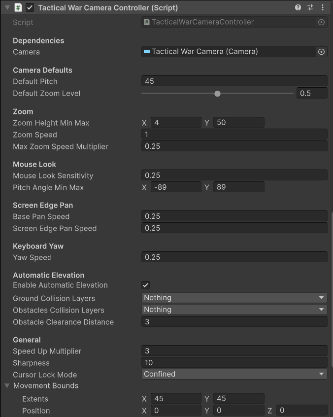
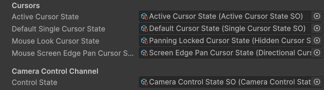

# Tactical War Camera Controller

A ground-level tactical camera inspired by the Total War series. Unlike the other controllers, this camera zooms by **raising and lowering its altitude** rather than moving forward and backward. Free-look pitch and yaw rotation is available via a held modifier key, letting the player survey terrain and units from any angle.

---

## Controls

### Keyboard

| Input | Action |
|---|---|
| `WASD` or `Arrow Keys` | Pan the camera |
| `Q` / `E` | Rotate camera yaw |
| `Shift` | Speed-up modifier — hold while panning for faster movement |
| `Space` | Reset pitch, yaw, and zoom to defaults |
| `Escape` *(Editor only)* | Release Game focus — stops camera input and frees the cursor |

### Mouse

| Input | Action |
|---|---|
| `Alt + Scroll Click + Drag` | Free-look — rotate pitch and yaw freely |
| `Scroll Wheel` | Zoom in / out (raises and lowers camera altitude) |

You can also pan the camera by moving the mouse cursor to the **edges of the screen**.

!!! info "Free-look binding"
    The free-look action uses a **one-modifier composite binding** (`Alt + Scroll Click`). For details on how to modify this, see the [Unity Input System documentation on action bindings](https://docs.unity3d.com/Packages/com.unity.inputsystem@1.19/manual/ActionBindings.html#one-modifier).

!!! tip "Remapping controls"
    All keybindings are defined in the `InputActions` asset for this controller. See [Input Remapping](../advanced/input-remapping.md).

---

## Pan Speed Scaling

Pan speed automatically scales down as the camera zooms in, so movement stays smooth and precise at close range.

---

## Configuration

Key properties exposed on the controller component:

| Property | Description |
|---|---|
| **Default Pitch** | The pitch the camera resets to when `Space` is pressed |
| **Zoom Height Min/Max** | The lowest and highest altitude the camera can reach via zoom |
| **Pan Speed** | Base speed for keyboard, and edge-scroll panning |
| **Speed-Up Multiplier** | Pan speed multiplier when the `Shift` modifier is held |
| **Yaw Speed** | Rotation speed for keyboard yaw |
| **Free Look Sensitivity** | Mouse sensitivity for free-look pitch and yaw |

---

## No Rig

Unlike the Classic RTS and Simulation cameras, the Tactical War Camera has **no rig**. The controller script manipulates the camera's transform directly.

---

## Related

- [Classic RTS Camera](./classic-rts-camera.md)
- [Simulation Camera](./simulation-camera.md)
- [Camera Bounds](../advanced/camera-bounds.md)
- [Automatic Elevation Adjustment](../advanced/auto-elevation.md)
